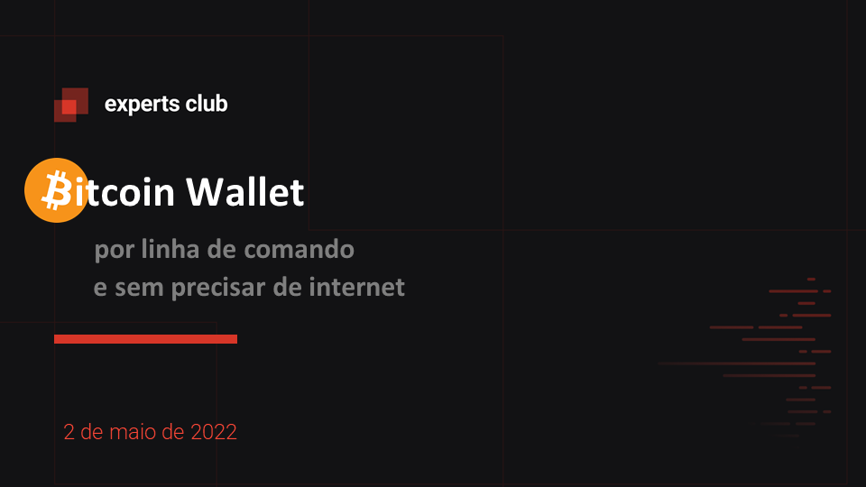
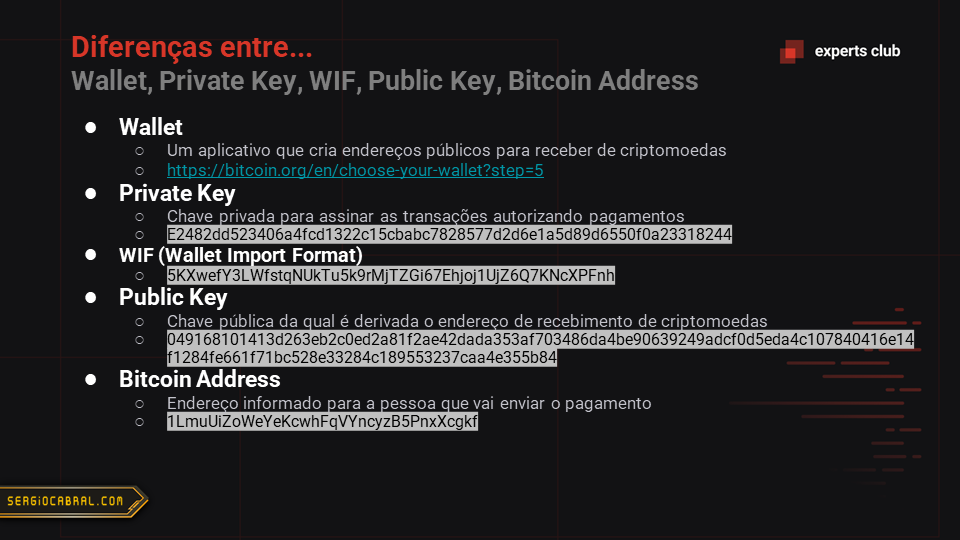
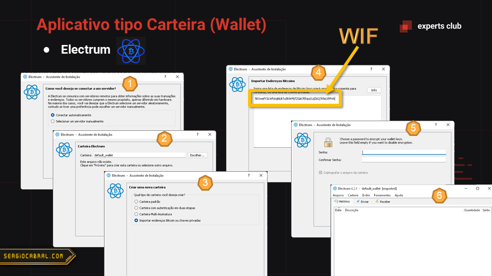

# Bitcoin Wallet

Este repositório contem scripts para geração de endereços de bitcoin capazes de receber moedas.

São scripts de linha de comando:
- Bash
- PowerShell

A proposta é possibilitar a criação de uma *Brain Wallet* sem necessidade de internet ou aplicativos. O script por si só é o aplicativo (Wallet) que gera as chaves privada (WIF) e pública (endereço para receber moedas).

## Script de única linha

Seguem os scripts de única linha.
Basta copiar e colar no terminal.
Para uso real lembre de definir a senha logo na variável que inicia o comando.

### Bash

Focado em ambiente Linux (testado no Ubuntu). As dependências para a execução são `openssl`, `base58`, `grep` e `xxd`.

```bash
PASSWORD="my-difficult-passphrase"; printf "\nBitcoin Address Generator\n\nPassword:\n$PASSWORD$([[ "$([[ "$(echo "ibase=16; FFFFFFFFFFFFFFFFFFFFFFFFFFFFFFFEBAAEDCE6AF48A03BBFD25E8CD0364141 - $(printf $(printf "$(printf "$PASSWORD" | openssl sha256)" | grep -o "[0-9a-f]\+\b") | tr a-z A-Z)" | bc | tr -d '\n\\' | [[ $(grep -o '^-') == '-' ]] && printf "" || printf "$(printf "$(printf "$PASSWORD" | openssl sha256)" | grep -o "[0-9a-f]\+\b")")" == "" ]] && printf "This password results in a hash that violates the secp256k1 algorithm used in Bitcoin. Try another password.")" != "" ]] && printf "\n\nError:\n$([[ "$(echo "ibase=16; FFFFFFFFFFFFFFFFFFFFFFFFFFFFFFFEBAAEDCE6AF48A03BBFD25E8CD0364141 - $(printf $(printf "$(printf "$PASSWORD" | openssl sha256)" | grep -o "[0-9a-f]\+\b") | tr a-z A-Z)" | bc | tr -d '\n\\' | [[ $(grep -o '^-') == '-' ]] && printf "" || printf "$(printf "$(printf "$PASSWORD" | openssl sha256)" | grep -o "[0-9a-f]\+\b")")" == "" ]] && printf "This password results in a hash that violates the secp256k1 algorithm used in Bitcoin. Try another password.")")$([[ "$([[ "$(echo "ibase=16; FFFFFFFFFFFFFFFFFFFFFFFFFFFFFFFEBAAEDCE6AF48A03BBFD25E8CD0364141 - $(printf $(printf "$(printf "$PASSWORD" | openssl sha256)" | grep -o "[0-9a-f]\+\b") | tr a-z A-Z)" | bc | tr -d '\n\\' | [[ $(grep -o '^-') == '-' ]] && printf "" || printf "$(printf "$(printf "$PASSWORD" | openssl sha256)" | grep -o "[0-9a-f]\+\b")")" == "" ]] && printf "This password results in a hash that violates the secp256k1 algorithm used in Bitcoin. Try another password.")" == "" ]] && printf "\n\nPrivate Key:\n$(printf "$(echo $(openssl ec -inform DER -text -noout -in <(printf "$(printf "302e0201010420$(echo "ibase=16; FFFFFFFFFFFFFFFFFFFFFFFFFFFFFFFEBAAEDCE6AF48A03BBFD25E8CD0364141 - $(printf $(printf "$(printf "$PASSWORD" | openssl sha256)" | grep -o "[0-9a-f]\+\b") | tr a-z A-Z)" | bc | tr -d '\n\\' | [[ $(grep -o '^-') == '-' ]] && printf "" || printf "$(printf "$(printf "$PASSWORD" | openssl sha256)" | grep -o "[0-9a-f]\+\b")")a00706052b8104000a")" | xxd -r -ps) 2> /dev/null))" | tr -d '\n ' | grep -o 'priv:[0-9a-f:]*' | sed -e 's/^priv//' | tr -d ':')")$([[ "$([[ "$(echo "ibase=16; FFFFFFFFFFFFFFFFFFFFFFFFFFFFFFFEBAAEDCE6AF48A03BBFD25E8CD0364141 - $(printf $(printf "$(printf "$PASSWORD" | openssl sha256)" | grep -o "[0-9a-f]\+\b") | tr a-z A-Z)" | bc | tr -d '\n\\' | [[ $(grep -o '^-') == '-' ]] && printf "" || printf "$(printf "$(printf "$PASSWORD" | openssl sha256)" | grep -o "[0-9a-f]\+\b")")" == "" ]] && printf "This password results in a hash that violates the secp256k1 algorithm used in Bitcoin. Try another password.")" == "" ]] && printf "\n\nPrivate Key, Wallet Import Format (WIF):\n$(printf "80$(printf "0000000000000000000000000000000000000000000000000000000000000000$(printf "$(echo $(openssl ec -inform DER -text -noout -in <(printf "$(printf "302e0201010420$(echo "ibase=16; FFFFFFFFFFFFFFFFFFFFFFFFFFFFFFFEBAAEDCE6AF48A03BBFD25E8CD0364141 - $(printf $(printf "$(printf "$PASSWORD" | openssl sha256)" | grep -o "[0-9a-f]\+\b") | tr a-z A-Z)" | bc | tr -d '\n\\' | [[ $(grep -o '^-') == '-' ]] && printf "" || printf "$(printf "$(printf "$PASSWORD" | openssl sha256)" | grep -o "[0-9a-f]\+\b")")a00706052b8104000a")" | xxd -r -ps) 2> /dev/null))" | tr -d '\n ' | grep -o 'priv:[0-9a-f:]*' | sed -e 's/^priv//' | tr -d ':')" | grep -o '[0-9a-f]\{64\}$')$(printf "$(printf "$(printf "$(printf "$(printf "80$(printf "0000000000000000000000000000000000000000000000000000000000000000$(printf "$(echo $(openssl ec -inform DER -text -noout -in <(printf "$(printf "302e0201010420$(echo "ibase=16; FFFFFFFFFFFFFFFFFFFFFFFFFFFFFFFEBAAEDCE6AF48A03BBFD25E8CD0364141 - $(printf $(printf "$(printf "$PASSWORD" | openssl sha256)" | grep -o "[0-9a-f]\+\b") | tr a-z A-Z)" | bc | tr -d '\n\\' | [[ $(grep -o '^-') == '-' ]] && printf "" || printf "$(printf "$(printf "$PASSWORD" | openssl sha256)" | grep -o "[0-9a-f]\+\b")")a00706052b8104000a")" | xxd -r -ps) 2> /dev/null))" | tr -d '\n ' | grep -o 'priv:[0-9a-f:]*' | sed -e 's/^priv//' | tr -d ':')" | grep -o '[0-9a-f]\{64\}$')" | xxd -r -ps | openssl sha256)" | grep -o "[0-9a-f]\+\b")" | xxd -r -ps | openssl sha256)" | grep -o "[0-9a-f]\+\b")" | grep -o "^[0-9a-f]\{8\}")" | xxd -r -ps | base58)")$([[ "$([[ "$(echo "ibase=16; FFFFFFFFFFFFFFFFFFFFFFFFFFFFFFFEBAAEDCE6AF48A03BBFD25E8CD0364141 - $(printf $(printf "$(printf "$PASSWORD" | openssl sha256)" | grep -o "[0-9a-f]\+\b") | tr a-z A-Z)" | bc | tr -d '\n\\' | [[ $(grep -o '^-') == '-' ]] && printf "" || printf "$(printf "$(printf "$PASSWORD" | openssl sha256)" | grep -o "[0-9a-f]\+\b")")" == "" ]] && printf "This password results in a hash that violates the secp256k1 algorithm used in Bitcoin. Try another password.")" == "" ]] && printf "\n\nPublic Key:\n$(printf "$(echo $(openssl ec -inform DER -text -noout -in <(printf "$(printf "302e0201010420$(echo "ibase=16; FFFFFFFFFFFFFFFFFFFFFFFFFFFFFFFEBAAEDCE6AF48A03BBFD25E8CD0364141 - $(printf $(printf "$(printf "$PASSWORD" | openssl sha256)" | grep -o "[0-9a-f]\+\b") | tr a-z A-Z)" | bc | tr -d '\n\\' | [[ $(grep -o '^-') == '-' ]] && printf "" || printf "$(printf "$(printf "$PASSWORD" | openssl sha256)" | grep -o "[0-9a-f]\+\b")")a00706052b8104000a")" | xxd -r -ps) 2> /dev/null))" | tr -d '\n ' | grep -o 'pub:[0-9a-f:]*' | sed -e 's/^pub//' | tr -d ':')")$([[ "$([[ "$(echo "ibase=16; FFFFFFFFFFFFFFFFFFFFFFFFFFFFFFFEBAAEDCE6AF48A03BBFD25E8CD0364141 - $(printf $(printf "$(printf "$PASSWORD" | openssl sha256)" | grep -o "[0-9a-f]\+\b") | tr a-z A-Z)" | bc | tr -d '\n\\' | [[ $(grep -o '^-') == '-' ]] && printf "" || printf "$(printf "$(printf "$PASSWORD" | openssl sha256)" | grep -o "[0-9a-f]\+\b")")" == "" ]] && printf "This password results in a hash that violates the secp256k1 algorithm used in Bitcoin. Try another password.")" == "" ]] && printf "\n\nPublic Key, Address:\n$(printf 00$(printf "$(printf "$(printf "$(printf "$(printf "$(echo $(openssl ec -inform DER -text -noout -in <(printf "$(printf "302e0201010420$(echo "ibase=16; FFFFFFFFFFFFFFFFFFFFFFFFFFFFFFFEBAAEDCE6AF48A03BBFD25E8CD0364141 - $(printf $(printf "$(printf "$PASSWORD" | openssl sha256)" | grep -o "[0-9a-f]\+\b") | tr a-z A-Z)" | bc | tr -d '\n\\' | [[ $(grep -o '^-') == '-' ]] && printf "" || printf "$(printf "$(printf "$PASSWORD" | openssl sha256)" | grep -o "[0-9a-f]\+\b")")a00706052b8104000a")" | xxd -r -ps) 2> /dev/null))" | tr -d '\n ' | grep -o 'pub:[0-9a-f:]*' | sed -e 's/^pub//' | tr -d ':')" | xxd -r -ps | openssl sha256)" | grep -o "[0-9a-f]\+\b")" | xxd -r -ps | openssl rmd160)" | grep -o "[0-9a-f]\+\b")$(printf "$(printf "$(printf "$(printf "$(printf "00$(printf "$(printf "$(printf "$(printf "$(printf "$(echo $(openssl ec -inform DER -text -noout -in <(printf "$(printf "302e0201010420$(echo "ibase=16; FFFFFFFFFFFFFFFFFFFFFFFFFFFFFFFEBAAEDCE6AF48A03BBFD25E8CD0364141 - $(printf $(printf "$(printf "$PASSWORD" | openssl sha256)" | grep -o "[0-9a-f]\+\b") | tr a-z A-Z)" | bc | tr -d '\n\\' | [[ $(grep -o '^-') == '-' ]] && printf "" || printf "$(printf "$(printf "$PASSWORD" | openssl sha256)" | grep -o "[0-9a-f]\+\b")")a00706052b8104000a")" | xxd -r -ps) 2> /dev/null))" | tr -d '\n ' | grep -o 'pub:[0-9a-f:]*' | sed -e 's/^pub//' | tr -d ':')" | xxd -r -ps | openssl sha256)" | grep -o "[0-9a-f]\+\b")" | xxd -r -ps | openssl rmd160)" | grep -o "[0-9a-f]\+\b")" | xxd -r -ps | openssl sha256)" | grep -o "[0-9a-f]\+\b")" | xxd -r -ps | openssl sha256)" | grep -o "[0-9a-f]\+\b")" | grep -o "^[0-9a-f]\{8\}") | xxd -r -ps | base58)")\n\n";
```

### PowerShell

Focado em ambiente Windows (testado no PowerShell Core).
A única dependência necessária foi o `openssl`.

```powershell
$password="my-difficult-passphrase"; $tempFile="$env:temp/btcaddress.tmp"; [System.IO.File]::WriteAllText($tempFile, $password); $passwordSha256=$(openssl sha256 $tempFile | Select-String "[0-9a-f]{64}").Matches[0].Value; $passwordSha256Secp256k1="302e0201010420${passwordSha256}a00706052b8104000a"; [System.IO.File]::WriteAllBytes($tempFile, [System.Convert]::FromHexString($passwordSha256Secp256k1)); $keys=$($(openssl ec -inform DER -text -noout -in $tempFile | Select-String "(?<=^\s+)[0-9a-f:]+").Matches | Select-Object -Property Value | ForEach-Object -Process {$_.Value.Replace(":", "")}); $keyPrivate=$keys[0]+$keys[1]+$keys[2]; $keyPublic=$keys[3]+$keys[4]+$keys[5]+$keys[6]+$keys[7]; [System.IO.File]::WriteAllBytes($tempFile, [System.Convert]::FromHexString($keyPublic)); $keyPublicSha256=$(openssl sha256 $tempFile | Select-String "[0-9a-f]{64}").Matches[0].Value; [System.IO.File]::WriteAllBytes($tempFile, [System.Convert]::FromHexString($keyPublicSha256)); $keyPublicSha256Ripemd160=$(openssl ripemd160 $tempFile | Select-String "[0-9a-f]{40}").Matches[0].Value; $keyPublicSha256Ripemd160Prefixed="00"+$keyPublicSha256Ripemd160; [System.IO.File]::WriteAllBytes($tempFile, [System.Convert]::FromHexString($keyPublicSha256Ripemd160Prefixed)); $keyPublicSha256Ripemd160Checksum=$(openssl sha256 $tempFile | Select-String "[0-9a-f]{64}").Matches[0].Value; [System.IO.File]::WriteAllBytes($tempFile, [System.Convert]::FromHexString($keyPublicSha256Ripemd160Checksum)); $keyPublicSha256Ripemd160Checksum=$(openssl sha256 $tempFile | Select-String "[0-9a-f]{64}").Matches[0].Value.Substring(0, 8); $bitcoinKeyPublic="$keyPublicSha256Ripemd160Prefixed$keyPublicSha256Ripemd160Checksum"; $keyPrivatePrefixed="80"+$keyPrivate.PadLeft(64, '0'); [System.IO.File]::WriteAllBytes($tempFile, [System.Convert]::FromHexString($keyPrivatePrefixed)); $keyPrivateChecksum=$(openssl sha256 $tempFile | Select-String "[0-9a-f]{64}").Matches[0].Value; [System.IO.File]::WriteAllBytes($tempFile, [System.Convert]::FromHexString($keyPrivateChecksum)); $keyPrivateChecksum=$(openssl sha256 $tempFile | Select-String "[0-9a-f]{64}").Matches[0].Value.Substring(0, 8); $bitcoinKeyPrivate="$keyPrivatePrefixed$keyPrivateChecksum"; function Base58 { param ([parameter(valuefrompipeline=$true)] [string]$1) $i=[bigint]::Parse($1,"AllowHexSpecifier"); $chars=@(); $index =@('1','2','3','4','5','6','7','8','9','A','B','C','D','E','F','G','H','J','K','L','M','N','P','Q','R','S','T','U','V','W','X','Y','Z','a','b','c','d','e','f','g','h','i','j','k','m','n','o','p','q','r','s','t','u','v','w','x','y','z'); if (($1).length % 2 -ne 0 -OR $i -lt 0) { $1="0$1"; $i=[bigint]::Parse($1, "AllowHexSpecifier"); } while($i -gt 0) { $m=([bigInt]$i % 58); $i=([bigInt]$i / 58); $chars+=$index[$m]; } [array]::reverse($chars); $i=$chars -join (''); $1 -split "(..)" | ForEach-Object { if ($_ -match "00") { $i=("1"+$i); } else { return; } }; $chars=@(); $chars.clear(); $index=@(); $index.clear(); return $i; }; $bitcoinKeyPrivateBase58=Base58($bitcoinKeyPrivate); $bitcoinKeyPublicBase58=Base58($bitcoinKeyPublic); [System.IO.File]::Delete($tempFile); Write-Output "Bitcoin Wallet`n`nPassword:`n$password`n`nPrivate Key:`n$keyPrivate`n`nPrivate Key, WIF:`n$bitcoinKeyPrivateBase58`n`nPublic Key:`n$keyPublic`n`nPublic Key, Wallet:`n$bitcoinKeyPublicBase58`n`n"
```

### Verificação

Para os comandos acima, você pode verificar os dados gerados em outros sites com mesmo propósito, isto é, de gerar endereço de maneira offline. Use a mesma senha no modo Brain Wallet e desmarque "Endereço compactado".

- [Coinb.in](https://coinb.in/)
- [BitAddress.org](https://www.bitaddress.org/)

Se os valores não baterem é porque a senha escolhida, após passar pela função de hash SHA256, não atende aos critérios do intervalo limite da [curva elíptica secp256k1](https://cryptobook.nakov.com/digital-signatures/ecdsa-sign-verify-messages).

**Neste caso tente outra senha.**

## Slides da aula








## Expert

| [](https://github.com/sergiocabral) |
| :-: |
|[sergiocabral.com](https://sergiocabral.com)|
